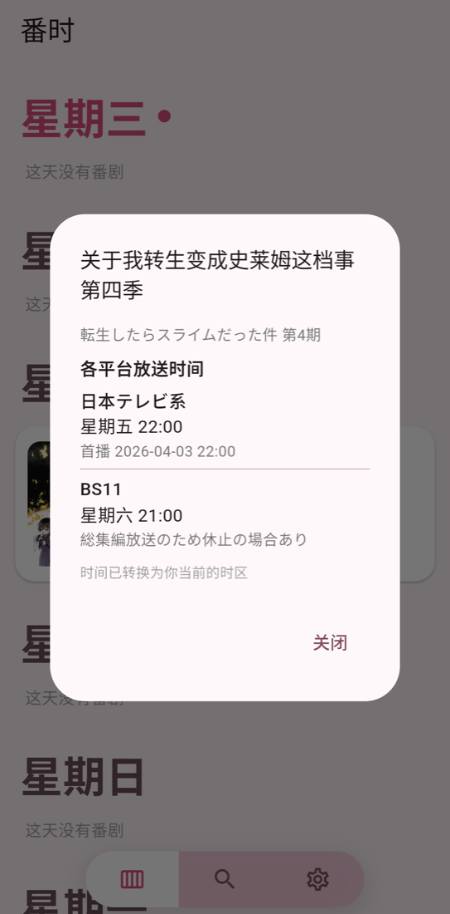

<div align="center">


# 番时

**这周有什么番，几点播，一眼看完。**

只关心正在放送的番剧。输入一个关键词，剩下的交给它。

**简体中文** · [繁體中文](README_zh-Hant.md) · [English](README_en.md)

<br/>

&nbsp;&nbsp;&nbsp;
&nbsp;&nbsp;&nbsp;
&nbsp;&nbsp;&nbsp;


</div>

<br/>

## 它做什么

**一张卡片，三行信息。** 封面、番名、首播日期和每周放送时间，再加一行平台。点开卡片，看到所有平台的放送时间，从最早到最晚。

**按星期排好。** 首页是一条循环的星期流，今天永远在最上面。往下滑，滑不到头；一个按钮随时回到今天。

**时间是你的时间。** 日本的「金曜 23:00」，在北京显示为周五 22:00，在纽约显示为周五 10:00。星期也按你所在的时区重新归类。

**只留正在播的。** 完结的番会被标出来，一键清掉。还没开播的可以先加进来，标着「即将开播」。

**一次查一部，或者一次查十部。** 高级搜索一行一个番名，也可以直接导入任意 bangumi 用户的在看/想看列表。

**三种语言。** 简体中文、繁體中文、English，番名也各有对应语言的版本。

**日式日期。** 想看「月曜日 火曜日」还是「星期一 星期二」，你说了算。

## 它怎么工作

```
关键词  →  Bangumi 番组计划  →  Tavily 搜索  →  LLM 整理  →  卡片
```

1. 用 [Bangumi](https://bgm.tv) 把模糊的关键词变成确定的番剧、封面和别名。
2. 用番剧的日文原名搜索放送时间。日文找不到，换英文、繁中、简中。
3. 让大语言模型把搜索结果整理成结构化的放送表。
4. 换算时区，画成卡片。

典型的一次查询：Bangumi 3 次、Tavily 1 次、LLM 1 次，约 4 秒。

## 你需要准备

| | 用途 | 免费额度 |
|---|---|---|
| **Tavily API Key** | 网页搜索 | 每月 1000 次 |
| **LLM API Key** | 整理放送表 | 视服务商而定 |

支持火山引擎（豆包）、DeepSeek、阿里云百炼（通义千问）、OpenAI、Anthropic，以及任何 OpenAI 兼容接口。国内服务商无需代理。

设置页里有 Tavily 的手把手注册教程。

## 隐私

- 没有账号，没有服务器。所有请求从你的手机直接发往 Bangumi、Tavily 和你选择的 LLM 服务商。
- 配置保存在手机的 `Documents/AnimeNow/`，卸载重装不丢失。
- API Key 以 AES-256-GCM 加密存储，密钥与你的设备绑定，换手机无法解密。
- 不收集任何数据。

## 下载

Android 6.0 及以上。推荐 Android 11 及以上，以获得「卸载重装不丢配置」的完整体验。

各架构的 APK 在 [Releases](https://github.com/erichuanp/anime-now/releases) 页面。绝大多数手机用 `arm64-v8a` 版本。

## 状态

1.0.0 版。源码暂未公开。

## 致谢

放送数据来自 [Bangumi 番组计划](https://bgm.tv)。搜索由 [Tavily](https://tavily.com) 提供。

<br/>

<div align="center">
<sub>MIT License · © 2026 erichuanp</sub>
</div>
