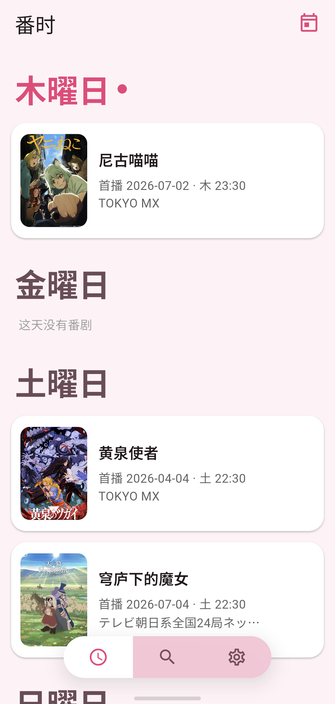
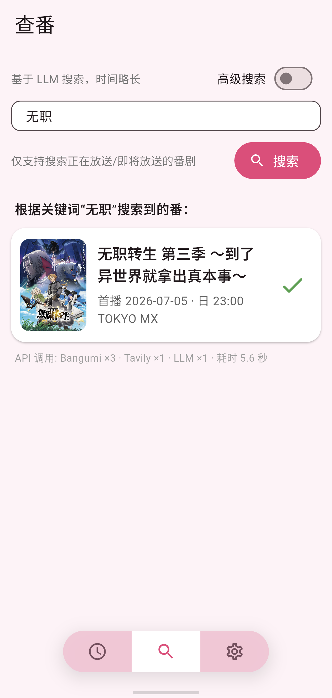
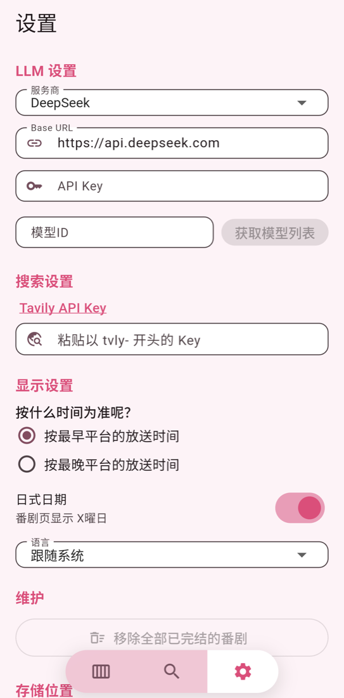

<div align="center">


# Anime Now

Only the anime that are airing now.

[简体中文](README.md) · [繁體中文](README_zh-Hant.md) · **English**

<br/>

&nbsp;&nbsp;&nbsp;
&nbsp;&nbsp;&nbsp;


</div>

<br/>

## About

Type one keyword and get a card: title, premiere date, weekly slot and platform.

The home screen is grouped by weekday with today on top. Times are converted to your timezone, and the weekday is regrouped accordingly. Notifications arrive when an episode airs.

## How it works

```
keyword  →  Bangumi  →  Tavily search  →  LLM  →  card
```

Broadcast times have no ready-made API. They come from web search, structured by a language model, so two keys of your own are required.

## What you need

| | For | Free tier |
|---|---|---|
| Tavily API key | Web search | 1000 per month |
| LLM API key | Structuring the schedule | Depends on the provider |

DeepSeek, Alibaba DashScope, Volcengine, OpenAI, Anthropic, and any OpenAI-compatible endpoint. Settings has a walkthrough for the Tavily key.

## Privacy

No account, no server. Requests go from the phone straight to Bangumi, Tavily and the provider you choose. Settings stay in the app's own directory; API keys are encrypted and bound to the device. Nothing is collected.

Using the Anime Now mirror means agreeing that the keywords you search, the bangumi usernames you enter and your IP pass through the author's server, where the author can see them. Switch back to the official source, or point the app at your own mirror, to avoid this. Tavily and LLM requests never go through the mirror; ask those providers about their own privacy terms.

## Download

[Releases](https://github.com/erichuanp/anime-now/releases). Android 6.0+, most phones want `arm64-v8a`.

## Status

Version 2026.9.3.0. The source is not public yet.

## Credits

Data from [Bangumi](https://bgm.tv); search by [Tavily](https://tavily.com).

<br/>

<div align="center">
<sub>MIT License · © 2026 erichuanp</sub>
</div>
